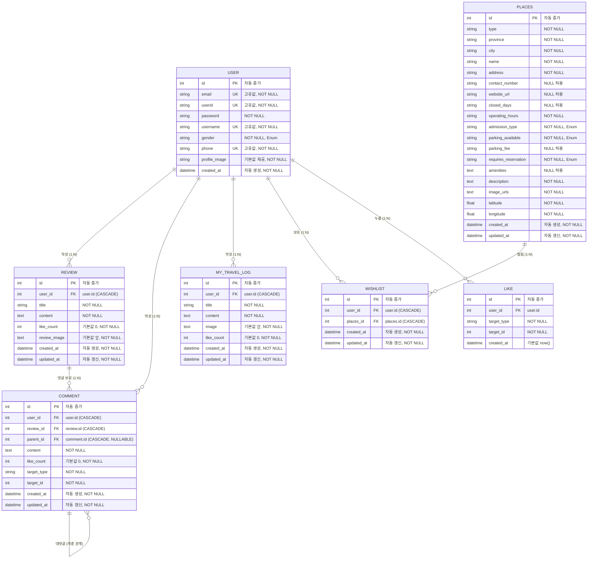
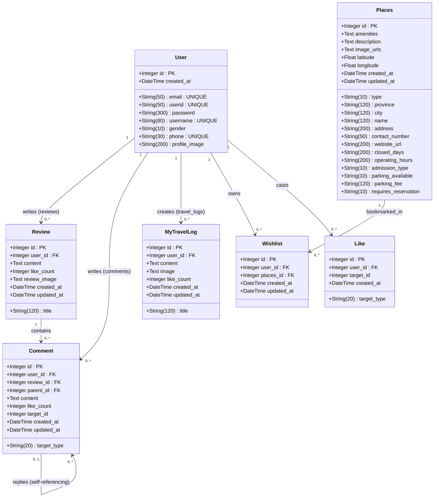

# Database Models & UML Specification

본 문서는 Flask SQLAlchemy 기반의 데이터베이스 모델 정의를 바탕으로 작성된 **UML 클래스 다이어그램(Class Diagram)**, **ERD(Entity-Relationship Diagram)** 및 **테이블/관계 상세 명세서**입니다.

---

## 1. UML 클래스 다이어그램 (Class Diagram)

객체 지향 모델 관점에서의 클래스 구조, 필드, 타입 및 클래스 간 연관 관계를 나타냅니다.

---

## 2. ERD 다이어그램 (Entity-Relationship Diagram)

물리 데이터베이스 관점의 테이블 간 관계, 외래키(FK) 및 제약조건을 나타냅니다.

[one.google.com/ai/credits](https://one.google.com/ai/credits)---

## 3. 엔티티 상세 명세 (Entity Specifications)

### 3.1. User (사용자)

- **설명**: 시스템 사용자 계정 정보
- **테이블명**: `user`

| 필드명            | 데이터 타입                 | 제약 조건         | 설명                                                    |
| :---------------- | :-------------------------- | :---------------- | :------------------------------------------------------ |
| `id`            | `Integer`                 | PK, Autoincrement | 사용자 고유 번호                                        |
| `email`         | `String(50)`              | UNIQUE, NOT NULL  | 이메일                                                  |
| `userid`        | `String(50)`              | UNIQUE, NOT NULL  | 사용자 로그인 아이디                                    |
| `password`      | `String(300)`             | NOT NULL          | 해시 암호화된 비밀번호                                  |
| `username`      | `String(80)`              | UNIQUE, NOT NULL  | 닉네임                                                  |
| `gender`        | `String(10)`              | NOT NULL          | 성별 (Enum)                                             |
| `phone`         | `String(30)`              | UNIQUE, NOT NULL  | 휴대폰 번호                                             |
| `profile_image` | `String(200)`             | NOT NULL          | 프로필 이미지 경로 (Default:`'user_img/default.jpg'`) |
| `created_at`    | `DateTime(timezone=True)` | NOT NULL          | 계정 생성일시                                           |

---

### 3.2. Places (여행지)

- **설명**: 여행지, 축제, 액티비티 정보
- **테이블명**: `places`

| 필드명                   | 데이터 타입                 | 제약 조건         | 설명                                  |
| :----------------------- | :-------------------------- | :---------------- | :------------------------------------ |
| `id`                   | `Integer`                 | PK, Autoincrement | 여행지 고유 번호                      |
| `type`                 | `String(10)`              | NOT NULL          | 분류 타입 (여행지, 축제, 액티비티 등) |
| `province`             | `String(120)`             | NOT NULL          | 시/도                                 |
| `city`                 | `String(120)`             | NOT NULL          | 시/군/구                              |
| `name`                 | `String(120)`             | NOT NULL          | 여행지 이름                           |
| `address`              | `String(200)`             | NOT NULL          | 상세 주소                             |
| `contact_number`       | `String(50)`              | NULLABLE          | 대표 연락처                           |
| `website_url`          | `String(200)`             | NULLABLE          | 공식 웹사이트 주소                    |
| `closed_days`          | `String(200)`             | NULLABLE          | 휴무일 정보                           |
| `operating_hours`      | `String(200)`             | NOT NULL          | 운영시간                              |
| `admission_type`       | `String(10)`              | NOT NULL          | 입장료 유무 (Enum)                    |
| `parking_available`    | `String(10)`              | NOT NULL          | 주차 가능 여부 (Enum)                 |
| `parking_fee`          | `String(120)`             | NULLABLE          | 주차 요금 정보                        |
| `requires_reservation` | `String(10)`              | NOT NULL          | 예약 필요 여부 (Enum)                 |
| `amenities`            | `Text`                    | NULLABLE          | 편의시설 및 부대시설 정보             |
| `description`          | `Text`                    | NOT NULL          | 소개글 및 상세 설명                   |
| `image_urls`           | `Text`                    | NOT NULL          | 이미지 URL 목록 (JSON/구분자 텍스트)  |
| `latitude`             | `Float`                   | NOT NULL          | 위치 위도                             |
| `longitude`            | `Float`                   | NOT NULL          | 위치 경도                             |
| `created_at`           | `DateTime(timezone=True)` | NOT NULL          | 등록일시                              |
| `updated_at`           | `DateTime(timezone=True)` | NOT NULL          | 수정일시                              |

---

### 3.3. Review (여행지 후기)

- **설명**: 사용자가 작성한 여행지 후기
- **테이블명**: `review`

| 필드명           | 데이터 타입                 | 제약 조건                  | 설명                        |
| :--------------- | :-------------------------- | :------------------------- | :-------------------------- |
| `id`           | `Integer`                 | PK, Autoincrement          | 리뷰 고유 번호              |
| `title`        | `String(120)`             | NOT NULL                   | 리뷰 제목                   |
| `content`      | `Text`                    | NOT NULL                   | 리뷰 본문 내용              |
| `like_count`   | `Integer`                 | NOT NULL, Default: 0       | 추천/좋아요(별점) 수        |
| `review_image` | `Text`                    | NOT NULL, Default:`'[]'` | 이미지 URL 목록 (JSON 포맷) |
| `created_at`   | `DateTime(timezone=True)` | NOT NULL                   | 작성일시                    |
| `updated_at`   | `DateTime(timezone=True)` | NOT NULL                   | 수정일시                    |
| `user_id`      | `Integer`                 | FK (`user.id`, CASCADE)  | 작성자 ID                   |

---

### 3.4. Comment (댓글)

- **설명**: 리뷰 및 대상 게시글에 달리는 댓글 및 대댓글
- **테이블명**: `comment`

| 필드명          | 데이터 타입                 | 제약 조건                              | 설명                         |
| :-------------- | :-------------------------- | :------------------------------------- | :--------------------------- |
| `id`          | `Integer`                 | PK, Autoincrement                      | 댓글 고유 번호               |
| `content`     | `Text`                    | NOT NULL                               | 댓글 본문                    |
| `like_count`  | `Integer`                 | NOT NULL, Default: 0                   | 좋아요 수                    |
| `target_type` | `String(20)`              | NOT NULL                               | 대상 엔티티 구분 (다형성)    |
| `target_id`   | `Integer`                 | NOT NULL                               | 대상 엔티티 ID (다형성)      |
| `created_at`  | `DateTime(timezone=True)` | NOT NULL                               | 작성일시                     |
| `updated_at`  | `DateTime(timezone=True)` | NOT NULL                               | 수정일시                     |
| `user_id`     | `Integer`                 | FK (`user.id`, CASCADE)              | 작성자 ID                    |
| `parent_id`   | `Integer`                 | FK (`comment.id`, CASCADE), NULLABLE | 상위 댓글 ID (대댓글 구현용) |
| `review_id`   | `Integer`                 | FK (`review.id`, CASCADE)            | 연결된 리뷰 ID               |

---

### 3.5. MyTravelLog (나의 여행로그)

- **설명**: 사용자의 개인 여행 기록/블로그 게시글
- **테이블명**: `my_travel_log`

| 필드명         | 데이터 타입                 | 제약 조건                  | 설명                        |
| :------------- | :-------------------------- | :------------------------- | :-------------------------- |
| `id`         | `Integer`                 | PK, Autoincrement          | 게시글 고유 번호            |
| `title`      | `String(120)`             | NOT NULL                   | 여행로그 제목               |
| `content`    | `Text`                    | NOT NULL                   | 본문 내용                   |
| `image`      | `Text`                    | NOT NULL, Default:`'[]'` | 이미지 URL 목록 (JSON 포맷) |
| `like_count` | `Integer`                 | NOT NULL, Default: 0       | 좋아요(별점) 수             |
| `created_at` | `DateTime(timezone=True)` | NOT NULL                   | 작성일시                    |
| `updated_at` | `DateTime(timezone=True)` | NOT NULL                   | 수정일시                    |
| `user_id`    | `Integer`                 | FK (`user.id`, CASCADE)  | 작성자 ID                   |

---

### 3.6. Wishlist (찜목록)

- **설명**: 사용자가 찜한 여행지 매핑 (다대다 연결 테이블)
- **테이블명**: `wishlist`

| 필드명         | 데이터 타입                 | 제약 조건                   | 설명           |
| :------------- | :-------------------------- | :-------------------------- | :------------- |
| `id`         | `Integer`                 | PK, Autoincrement           | 찜 식별 번호   |
| `created_at` | `DateTime(timezone=True)` | NOT NULL                    | 찜 등록일시    |
| `updated_at` | `DateTime(timezone=True)` | NOT NULL                    | 수정일시       |
| `user_id`    | `Integer`                 | FK (`user.id`, CASCADE)   | 찜한 사용자 ID |
| `places_id`  | `Integer`                 | FK (`places.id`, CASCADE) | 찜한 여행지 ID |

---

### 3.7. Like (좋아요)

- **설명**: 다형성(Generic) 타겟 대상 좋아요 기록
- **테이블명**: `like`

| 필드명          | 데이터 타입    | 제약 조건                  | 설명                                                |
| :-------------- | :------------- | :------------------------- | :-------------------------------------------------- |
| `id`          | `Integer`    | PK, Autoincrement          | 좋아요 고유 번호                                    |
| `user_id`     | `Integer`    | FK (`user.id`), NOT NULL | 누른 사용자 ID                                      |
| `target_type` | `String(20)` | NOT NULL                   | 좋아요 대상 모델명 (`Review`, `MyTravelLog` 등) |
| `target_id`   | `Integer`    | NOT NULL                   | 좋아요 대상 엔티티 ID                               |
| `created_at`  | `DateTime`   | Default:`now()`          | 등록일시                                            |

> **Unique 제약조건**: `(user_id, target_type, target_id)`
> 동일 사용자가 특정 대상에 중복으로 좋아요를 누르는 것을 DB 레벨에서 방지 (`uix_user_target_like`).

---

## 4. 모델 설계 핵심 특징

1. **사용자 종속성 및 CASCADE 무결성**:

   - `User` 삭제 시 해당 유저가 작성한 모든 후기(`Review`), 댓글(`Comment`), 여행로그(`MyTravelLog`), 찜목록(`Wishlist`)이 DB 레벨에서 안전하게 자동 삭제되도록 `ondelete='CASCADE'` 설정이 적용되어 있습니다.
2. **계층형 대댓글(Self-Referencing Relationship)**:

   - `Comment` 모델의 `parent_id`가 `comment.id`를 참조하는 자가 참조(Self-Referencing) 구조를 갖추고 있습니다.
   - 부모 댓글이 삭제되면 하위 답글들도 연쇄적으로 삭제되도록 `cascade='all, delete'`가 설정되어 있습니다.
3. **다형성 구조(Generic Polymorphism)**:

   - `Like` 및 `Comment` 모델에 `target_type`과 `target_id`가 포함되어 있어, 특정 테이블 하나에 국한되지 않고 다양한 게시물 유형을 범용적으로 참조할 수 있는 구조입니다.

