# 📊 데이터베이스 모델링 및 ER 다이어그램 (ERD) 명세서

본 문서는 Flask 관광지 안내 & 여행 투어 웹 애플리케이션의 **물리 데이터베이스 설계(Database Modeling)**, **ER 다이어그램 (Entity-Relationship Diagram)** 및 **테이블별 상세 명세**입니다.

---

## 1. ER 다이어그램 (ER Diagram)

```mermaid
erDiagram
    %% Relationships
    USERS ||--o| CARTS : "소유 (1:1)"
    CARTS ||--o{ CART_ITEMS : "보유 (1:N)"
    TOUR_PRODUCTS ||--o{ CART_ITEMS : "담김 (1:N)"

    THEMES ||--o{ TOUR_PRODUCTS : "분류 (1:N)"

    USERS ||--o{ PRODUCT_LIKES : "추천 클릭 (1:N)"
    TOUR_PRODUCTS ||--o{ PRODUCT_LIKES : "추천 받음 (1:N)"

    USERS |o--o{ ORDERS : "주문 (0..1:N, 비회원 허용)"
    ORDERS ||--|{ ORDER_ITEMS : "주문 품목 포함 (1:N)"
    TOUR_PRODUCTS ||--o{ ORDER_ITEMS : "주문됨 (1:N)"
    ORDERS ||--o{ ORDER_ACCOMMODATIONS : "숙박 예약 포함 (1:N)"
    ACCOMMODATIONS ||--o{ ORDER_ACCOMMODATIONS : "예약됨 (1:N)"
    ORDERS ||--|| PAYMENTS : "결제 매핑 (1:1)"

    USERS ||--o{ REVIEWS : "작성 (1:N)"
    TOUR_PRODUCTS ||--o{ REVIEWS : "후기 보유 (1:N)"

    %% Entity Definitions
    USERS {
        int id PK "고유 번호 (Auto Increment)"
        varchar username UK "로그인 ID (고유값, Not Null)"
        varchar password_hash "단방향 암호화 비밀번호 (Not Null)"
        varchar name "회원 이름 (Not Null)"
        varchar email UK "이메일 주소 (고유값, Not Null)"
        varchar phone UK "휴대폰 번호 (고유값, Not Null)"
        varchar role "회원 권한 (MEMBER, ADMIN)"
        datetime created_at "가입 일시"
    }

    THEMES {
        int id PK "테마 고유 번호 (Auto Increment)"
        varchar code UK "테마 코드 (RESORT, EXPERIENCE 등)"
        varchar name UK "테마 명칭 (휴양지, 체험 등)"
        varchar description "테마 상세 설명"
        boolean is_active "활성화 여부 (Default True)"
    }

    TOUR_PRODUCTS {
        int id PK "상품 고유 번호 (Auto Increment)"
        varchar name "관광 상품명 (Not Null)"
        text description "상세 소개글 (Not Null)"
        varchar region "6대 권역 (서울/경기, 강원, 충청, 전라, 경북, 제주)"
        int theme_id FK "테마 외래키 (themes.id)"
        int original_price "정상 판매가 (원)"
        float member_discount_rate "회원 할인율 (예: 0.15 = 15%)"
        int recommendation_count "누적 추천 수 (Default 0)"
        varchar image_url "대표 이미지 경로/URL"
        text image_urls "다중 고화질 사진 JSON URL 목록"
        datetime created_at "등록 일시"
    }

    ACCOMMODATIONS {
        int id PK "숙박 시설 고유 번호 (Auto Increment)"
        varchar name "숙소 이름 (Not Null)"
        varchar acc_type "숙박 유형 (민박, 호텔)"
        varchar region "지역 권역 (서울/경기, 강원, 제주 등)"
        int price_per_night "1박 정상 요금 (원)"
        float member_discount_rate "회원 우대 할인율 (예: 0.15 = 15%)"
        float rating "숙소 평점 (예: 4.8)"
        varchar features "주요 편의 특징 태그 (쉼표 구분)"
        varchar image_url "숙소 대표 이미지 URL"
        text description "숙소 소개 설명"
        boolean is_recommended "추천 여부 (Default True)"
        datetime created_at "등록 일시"
    }

    PRODUCT_LIKES {
        int id PK "추천 고유 번호 (Auto Increment)"
        int user_id FK "추천한 회원 ID (users.id, Cascade)"
        int product_id FK "추천된 상품 ID (tour_products.id, Cascade)"
        datetime created_at "추천 일시"
    }

    CARTS {
        int id PK "장바구니 번호 (Auto Increment)"
        int user_id FK "소유 회원 ID (users.id, Unique, Cascade)"
        datetime updated_at "최종 수정 일시"
    }

    CART_ITEMS {
        int id PK "품목 번호 (Auto Increment)"
        int cart_id FK "장바구니 ID (carts.id, Cascade)"
        int product_id FK "관광 상품 ID (tour_products.id, Cascade)"
        int quantity "담은 수량 (인원수, Not Null)"
        datetime created_at "담은 일시"
    }

    ORDERS {
        int id PK "주문 번호 (Auto Increment)"
        varchar order_no UK "주문 식별 번호 (예: ORD-2026...)"
        int user_id FK "주문 회원 ID (users.id, Nullable: 비회원 허용)"
        varchar guest_name "비회원 주문자 성함 (Nullable)"
        varchar guest_email "비회원 이메일 (Nullable)"
        varchar guest_phone "비회원 연락처 (Nullable)"
        int original_amount "정상 상품가 총액 (원)"
        int discount_amount "회원 할인 적용 총액 (원)"
        int final_amount "최종 실 결제 금액 (원)"
        varchar status "주문 상태 (PENDING, COMPLETED, CANCELLED)"
        datetime created_at "주문 일시"
    }

    ORDER_ITEMS {
        int id PK "주문 상세 번호 (Auto Increment)"
        int order_id FK "연결된 주문 ID (orders.id, Cascade)"
        int product_id FK "주문된 상품 ID (tour_products.id)"
        int quantity "주문 수량 (Not Null)"
        int unit_price "주문 시점 적용 단가 (원)"
        int discount_applied "개당 할인 적용액 (원)"
        int subtotal_price "항목별 소계 금액 (원)"
    }

    ORDER_ACCOMMODATIONS {
        int id PK "주문 숙박 상세 번호 (Auto Increment)"
        int order_id FK "연결된 주문 ID (orders.id, Cascade)"
        int accommodation_id FK "예약된 숙박 ID (accommodations.id)"
        int nights "투숙 박수 (기본 1박)"
        int unit_price "주문 시점 적용 1박 단가 (원)"
        int discount_applied "박당 할인 적용액 (원)"
        int subtotal_price "숙박 소계 금액 (원)"
    }

    PAYMENTS {
        int id PK "결제 번호 (Auto Increment)"
        int order_id FK "연결된 주문 ID (orders.id, Unique, Cascade)"
        varchar payment_method "결제 수단 (CARD, EASY_PAY, BANK_TRANSFER)"
        int paid_amount "실제 승인 결제 금액 (원)"
        varchar transaction_id UK "PG 거래 승인 식별 번호"
        varchar status "결제 상태 (SUCCESS, FAILED, CANCELLED)"
        datetime paid_at "결제 승인 일시"
    }

    REVIEWS {
        int id PK "후기 번호 (Auto Increment)"
        int user_id FK "작성자 회원 ID (users.id, Cascade)"
        int product_id FK "대상 관광 상품 ID (tour_products.id, Cascade)"
        varchar title "후기 제목 (Not Null)"
        text content "후기 내용 (Not Null)"
        int rating "별점 평점 (1~5점)"
        datetime created_at "작성 일시"
        datetime updated_at "수정 일시"
    }
```

---

## 2. 테이블별 상세 설계 명세서

### 2.1. `users` (회원 정보)
- **설명**: 사이트에 가입한 회원 계정 정보 관리 (1인 1계정)

| 컬럼명 | 데이터 타입 | 제약 조건 | 기본값 | 설명 |
| :--- | :--- | :--- | :--- | :--- |
| `id` | `INTEGER` | PK, Auto Increment | - | 회원 식별 고유 번호 |
| `username` | `VARCHAR(50)` | UNIQUE, NOT NULL | - | 로그인 아이디 (4~20자) |
| `password_hash` | `VARCHAR(255)` | NOT NULL | - | Werkzeug 단방향 해시 암호화 비밀번호 |
| `name` | `VARCHAR(80)` | NOT NULL | - | 사용자 실명 / 이름 |
| `email` | `VARCHAR(120)` | UNIQUE, NOT NULL | - | 이메일 주소 |
| `phone` | `VARCHAR(30)` | UNIQUE, NOT NULL | - | 휴대폰 번호 (중복 불가) |
| `role` | `VARCHAR(20)` | NOT NULL | `'MEMBER'` | 계정 권한 (`MEMBER`, `ADMIN`) |
| `created_at` | `DATETIME` | NOT NULL | `CURRENT_TIMESTAMP` | 회원 가입 일시 |

---

### 2.2. `themes` (테마 카테고리)
- **설명**: 관광 상품을 분류하는 테마 마스터 테이블 (휴양지, 체험 외 신규 테마 무한 확장 가능)

| 컬럼명 | 데이터 타입 | 제약 조건 | 기본값 | 설명 |
| :--- | :--- | :--- | :--- | :--- |
| `id` | `INTEGER` | PK, Auto Increment | - | 테마 식별 번호 |
| `code` | `VARCHAR(50)` | UNIQUE, NOT NULL | - | 테마 코드명 (`RESORT`, `EXPERIENCE`, `CULTURE` 등) |
| `name` | `VARCHAR(50)` | UNIQUE, NOT NULL | - | 테마 표시 명칭 ('휴양지', '체험', '문화/역사' 등) |
| `description` | `VARCHAR(200)` | NULLABLE | - | 테마에 대한 간단한 소개글 |
| `is_active` | `BOOLEAN` | NOT NULL | `True` | 노출/활성화 여부 |

---

### 2.3. `tour_products` (관광 여행 상품)
- **설명**: 6대 권역별 관광지 및 여행 패키지 코스 정보

| 컬럼명 | 데이터 타입 | 제약 조건 | 기본값 | 설명 |
| :--- | :--- | :--- | :--- | :--- |
| `id` | `INTEGER` | PK, Auto Increment | - | 상품 고유 식별 번호 |
| `name` | `VARCHAR(150)` | NOT NULL | - | 관광 여행 상품명 |
| `description` | `TEXT` | NOT NULL | - | 상품 상세 소개 및 코스 안내 |
| `region` | `VARCHAR(50)` | NOT NULL | - | 6대 권역 (`서울/경기`, `강원`, `충청`, `전라`, `경북`, `제주`) |
| `theme_id` | `INTEGER` | FK (`themes.id`), NOT NULL | - | 분류 테마 외래키 |
| `original_price` | `INTEGER` | NOT NULL | - | 비회원 정상 판매 가격 (원) |
| `member_discount_rate` | `FLOAT` | NOT NULL | `0.15` | 회원 특별 할인율 (0.10 ~ 0.20) |
| `recommendation_count` | `INTEGER` | NOT NULL | `0` | 누적 추천(좋아요) 수 (랭킹 정렬 기준) |
| `image_url` | `VARCHAR(255)` | NULLABLE | 기본 이미지 | 대표 썸네일 이미지 주소 |
| `image_urls` | `TEXT` | NULLABLE | - | 관광지별 3~4개 이상 고화질 이미지 JSON 목록 |
| `created_at` | `DATETIME` | NOT NULL | `CURRENT_TIMESTAMP` | 상품 등록 일시 |

---

### 2.4. `product_likes` (상품 추천 이력)
- **설명**: 회원의 관광 상품 추천(좋아요) 기록 (1인 1상품 1회 추천 제약)

| 컬럼명 | 데이터 타입 | 제약 조건 | 설명 |
| :--- | :--- | :--- | :--- |
| `id` | `INTEGER` | PK, Auto Increment | 추천 식별 번호 |
| `user_id` | `INTEGER` | FK (`users.id`, CASCADE), NOT NULL | 추천한 회원 ID |
| `product_id` | `INTEGER` | FK (`tour_products.id`, CASCADE), NOT NULL | 추천된 상품 ID |
| `created_at` | `DATETIME` | NOT NULL | 추천 등록 일시 |

> **Unique 제약조건**: `UNIQUE(user_id, product_id)` → 동일 사용자의 중복 추천 방지

---

### 2.5. `carts` & `cart_items` (장바구니)
- **설명**: 로그인 회원의 여행 상품 보관함

#### `carts` (회원별 장바구니 헤더)
| 컬럼명 | 데이터 타입 | 제약 조건 | 설명 |
| :--- | :--- | :--- | :--- |
| `id` | `INTEGER` | PK, Auto Increment | 장바구니 식별 번호 |
| `user_id` | `INTEGER` | FK (`users.id`, CASCADE), UNIQUE, NOT NULL | 장바구니 소유 회원 ID (1:1 매핑) |
| `updated_at` | `DATETIME` | NOT NULL | 최종 변경 일시 |

#### `cart_items` (장바구니 상세 품목)
| 컬럼명 | 데이터 타입 | 제약 조건 | 설명 |
| :--- | :--- | :--- | :--- |
| `id` | `INTEGER` | PK, Auto Increment | 장바구니 품목 식별 번호 |
| `cart_id` | `INTEGER` | FK (`carts.id`, CASCADE), NOT NULL | 연결된 장바구니 ID |
| `product_id` | `INTEGER` | FK (`tour_products.id`, CASCADE), NOT NULL | 담은 관광 상품 ID |
| `quantity` | `INTEGER` | NOT NULL (기본 1) | 선택한 인원/수량 (1~99) |
| `created_at` | `DATETIME` | NOT NULL | 장바구니 담은 일시 |

> **Unique 제약조건**: `UNIQUE(cart_id, product_id)` → 장바구니 내 동일 상품 중복 등록 시 수량만 증가

---

### 2.6. `orders` & `order_items` (주문 및 예약 내역)
- **설명**: 회원 및 비회원의 여행 상품 주문 내역과 결제 금액 스냅샷 보존

#### `orders` (주문 헤더)
| 컬럼명 | 데이터 타입 | 제약 조건 | 설명 |
| :--- | :--- | :--- | :--- |
| `id` | `INTEGER` | PK, Auto Increment | 주문 고유 번호 |
| `order_no` | `VARCHAR(64)` | UNIQUE, NOT NULL | 고유 주문 식별 번호 (`ORD-2026...`) |
| `user_id` | `INTEGER` | FK (`users.id`, CASCADE), **NULLABLE** | 주문 회원 ID (**비회원 주문 시 NULL**) |
| `guest_name` | `VARCHAR(80)` | **NULLABLE** | 비회원 예약자 이름 (비회원 결제 시 필수) |
| `guest_email` | `VARCHAR(120)` | **NULLABLE** | 비회원 예약 확인서 이메일 |
| `guest_phone` | `VARCHAR(30)` | **NULLABLE** | 비회원 연락처 |
| `original_amount` | `INTEGER` | NOT NULL | 정상 상품 금액 합계 (정가 기준) |
| `discount_amount` | `INTEGER` | NOT NULL, 기본 0 | 회원 우대 할인 적용 총액 (비회원은 0) |
| `final_amount` | `INTEGER` | NOT NULL | 최종 결제 금액 (`original_amount - discount_amount`) |
| `status` | `VARCHAR(20)` | NOT NULL, 기본 `'COMPLETED'` | 주문 상태 (`PENDING`, `COMPLETED`, `CANCELLED`) |
| `created_at` | `DATETIME` | NOT NULL | 주문 발생 일시 |

#### `order_items` (주문 상세 품목)
| 컬럼명 | 데이터 타입 | 제약 조건 | 설명 |
| :--- | :--- | :--- | :--- |
| `id` | `INTEGER` | PK, Auto Increment | 주문 항목 식별 번호 |
| `order_id` | `INTEGER` | FK (`orders.id`, CASCADE), NOT NULL | 연결된 주문 ID |
| `product_id` | `INTEGER` | FK (`tour_products.id`), NOT NULL | 구매한 관광 상품 ID |
| `quantity` | `INTEGER` | NOT NULL | 주문 인원/수량 |
| `unit_price` | `INTEGER` | NOT NULL | 주문 시점 적용 단가 |
| `discount_applied` | `INTEGER` | NOT NULL, 기본 0 | 품목별 적용된 회원 할인액 |
| `subtotal_price` | `INTEGER` | NOT NULL | 항목 소계 금액 (`unit_price * quantity`) |

---

### 2.7. `payments` (결제 내역)
- **설명**: 주문에 대한 모의 결제 트랜잭션 기록 (1:1 매핑)

| 컬럼명 | 데이터 타입 | 제약 조건 | 설명 |
| :--- | :--- | :--- | :--- |
| `id` | `INTEGER` | PK, Auto Increment | 결제 식별 번호 |
| `order_id` | `INTEGER` | FK (`orders.id`, CASCADE), UNIQUE, NOT NULL | 결제 대상 주문 ID |
| `payment_method` | `VARCHAR(30)` | NOT NULL | 결제 수단 (`CARD`, `EASY_PAY`, `BANK_TRANSFER`) |
| `paid_amount` | `INTEGER` | NOT NULL | 승인 완료된 결제 금액 (원) |
| `transaction_id` | `VARCHAR(100)` | UNIQUE, NOT NULL | PG 결제 승인 고유 번호 (`TX-...`) |
| `status` | `VARCHAR(20)` | NOT NULL, 기본 `'SUCCESS'` | 결제 상태 (`SUCCESS`, `FAILED`, `REFUNDED`) |
| `paid_at` | `DATETIME` | NOT NULL | 결제 승인 일시 |

---

### 2.8. `reviews` (여행 후기)
- **설명**: 회원이 이용 후 작성한 관광 상품 리뷰

| 컬럼명 | 데이터 타입 | 제약 조건 | 설명 |
| :--- | :--- | :--- | :--- |
| `id` | `INTEGER` | PK, Auto Increment | 후기 식별 번호 |
| `user_id` | `INTEGER` | FK (`users.id`, CASCADE), NOT NULL | 작성 회원 ID |
| `product_id` | `INTEGER` | FK (`tour_products.id`, CASCADE), NOT NULL | 후기 대상 관광 상품 ID |
| `title` | `VARCHAR(150)` | NOT NULL | 후기 제목 |
| `content` | `TEXT` | NOT NULL | 후기 본문 내용 |
| `rating` | `INTEGER` | NOT NULL, 기본 5 | 별점 점수 (1 ~ 5점) |
| `created_at` | `DATETIME` | NOT NULL | 후기 등록 일시 |
| `updated_at` | `DATETIME` | NOT NULL | 후기 최종 수정 일시 |

---

### 2.9. `accommodations` (추천 숙박 시설)
- **설명**: 6대 권역별 회원 우대 연계 예약 숙박 시설 ([민박] 및 [호텔]) 정보 관리

| 컬럼명 | 데이터 타입 | 제약 조건 | 기본값 | 설명 |
| :--- | :--- | :--- | :--- | :--- |
| `id` | `INTEGER` | PK, Auto Increment | - | 숙박 시설 식별 고유 번호 |
| `name` | `VARCHAR(120)` | NOT NULL | - | 숙소 명칭 |
| `acc_type` | `VARCHAR(20)` | NOT NULL | - | 숙박 유형 (`'민박'` 또는 `'호텔'`) |
| `region` | `VARCHAR(50)` | NOT NULL | - | 소속 권역 (`서울/경기`, `강원`, `제주` 등) |
| `price_per_night` | `INTEGER` | NOT NULL | - | 1박 정상 요금 (원) |
| `member_discount_rate` | `FLOAT` | NOT NULL | `0.10` | 회원 우대 할인율 (예: `0.15` = 15%) |
| `rating` | `FLOAT` | NOT NULL | `4.5` | 숙소 이용 평점 (1.0 ~ 5.0) |
| `features` | `VARCHAR(255)` | NULLABLE | - | 편의시설 및 특징 키워드 (쉼표 구분 태그) |
| `image_url` | `VARCHAR(300)` | NULLABLE | - | 숙소 대표 이미지 URL |
| `description` | `TEXT` | NULLABLE | - | 숙소 소개 및 매력 포인트 설명 |
| `is_recommended` | `BOOLEAN` | NOT NULL | `True` | 추천 전시 여부 |
| `created_at` | `DATETIME` | NOT NULL | `CURRENT_TIMESTAMP` | 숙소 정보 등록 일시 |

---

### 2.10. `order_accommodations` (주문 연계 숙박 내역)
- **설명**: 회원이 관광 투어 상품과 함께 연계 예약한 숙박 시설의 주문 시점 가격 및 예약 내역 (1:N 매핑)

| 컬럼명 | 데이터 타입 | 제약 조건 | 설명 |
| :--- | :--- | :--- | :--- |
| `id` | `INTEGER` | PK, Auto Increment | 주문 숙박 식별 번호 |
| `order_id` | `INTEGER` | FK (`orders.id`, CASCADE), NOT NULL | 연결된 주문 ID |
| `accommodation_id` | `INTEGER` | FK (`accommodations.id`), NOT NULL | 예약된 숙박 시설 ID |
| `nights` | `INTEGER` | NOT NULL, 기본 1 | 투숙 박수 (기본 1박) |
| `unit_price` | `INTEGER` | NOT NULL | 예약 시점 1박 정상 단가 (원) |
| `discount_applied` | `INTEGER` | NOT NULL, 기본 0 | 회원 우대 박당 할인액 (원) |
| `subtotal_price` | `INTEGER` | NOT NULL | 숙박 최종 결제 소계 금액 (원) |

---

## 3. 주요 무결성 및 관계 설계 특징

1. **회원/비회원 주문 통합 설계 (`orders`)**:
   - `user_id` 컬럼을 `NULLABLE`로 지정하여, 회원 주문뿐만 아니라 비회원의 **[비회원 바로 구매하기]** 주문도 한 테이블에서 통합 관리합니다.
   - 비회원일 경우 `guest_name`, `guest_email`, `guest_phone`을 보관하며 `discount_amount = 0`으로 정가 결제됩니다.
2. **외래키 제약조건 및 연쇄 삭제 (CASCADE)**:
   - 회원이 탈퇴(`User` 삭제)할 경우 해당 회원의 장바구니(`Cart`), 작성 후기(`Review`), 추천 이력(`ProductLike`), 주문 연계 숙박(`OrderAccommodation`)이 안전하게 연쇄 처리되어 고아(Orphan) 데이터를 방지합니다.
3. **1인 1회 추천 무결성 (`ProductLike`)**:
   - `(user_id, product_id)`의 복합 유니크 인덱스를 통해 동일 상품에 대한 중복 추천을 DB 레벨에서 완벽하게 차단합니다.
4. **결제 이력 불변성 (`OrderItem`, `OrderAccommodation` 스냅샷)**:
   - 관광 상품이나 숙박 시설의 가격, 회원 할인율이 향후 변경되더라도, 과거 주문 내역의 `unit_price`, `discount_applied`, `subtotal_price`는 주문 시점의 스냅샷 가격 그대로 불변 보존됩니다.
5. **회원 전용 숙박 연계 예약 및 카테고리별 최대 2개 선택 제약**:
   - 관광 상품 상세 화면에서 [민박]과 [호텔] 카테고리별로 각각 **최대 2개까지** 선택할 수 있도록 UI와 컨트롤러에서 철저히 검증 및 제한합니다.
   - 선택된 숙박 시설은 단일 트랜잭션으로 주문서 결제 및 `OrderAccommodation` 테이블에 안전하게 적재됩니다.

