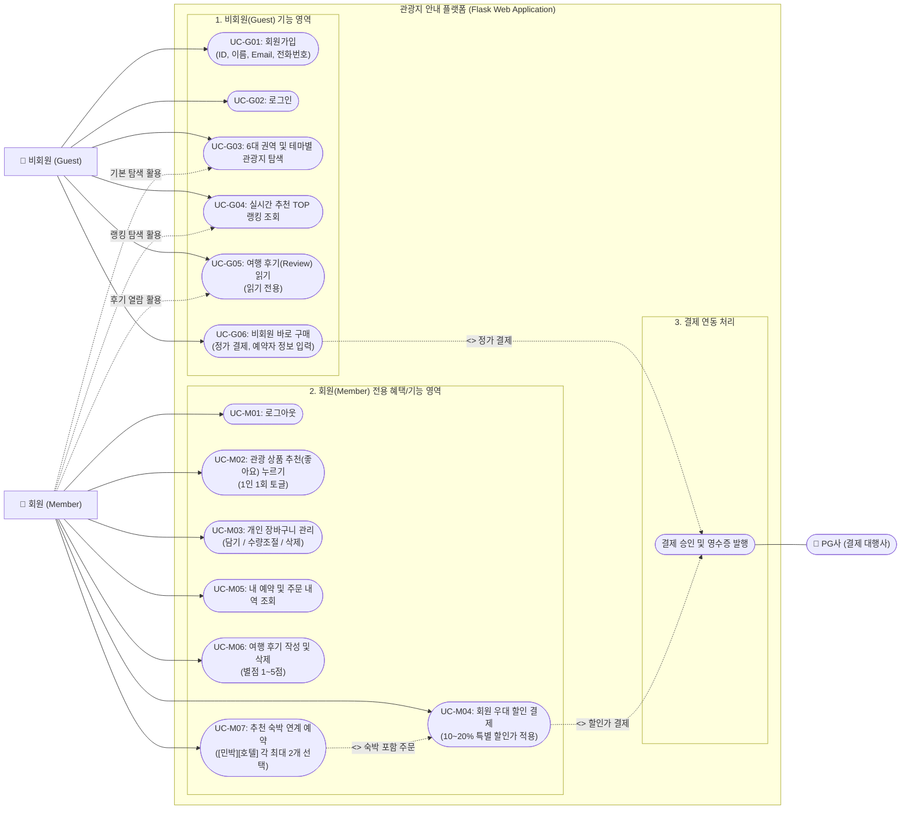
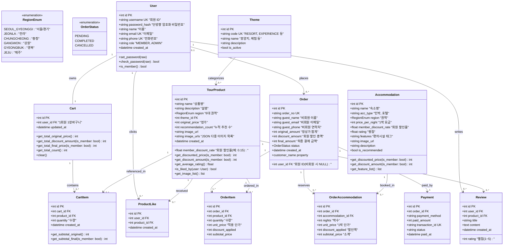
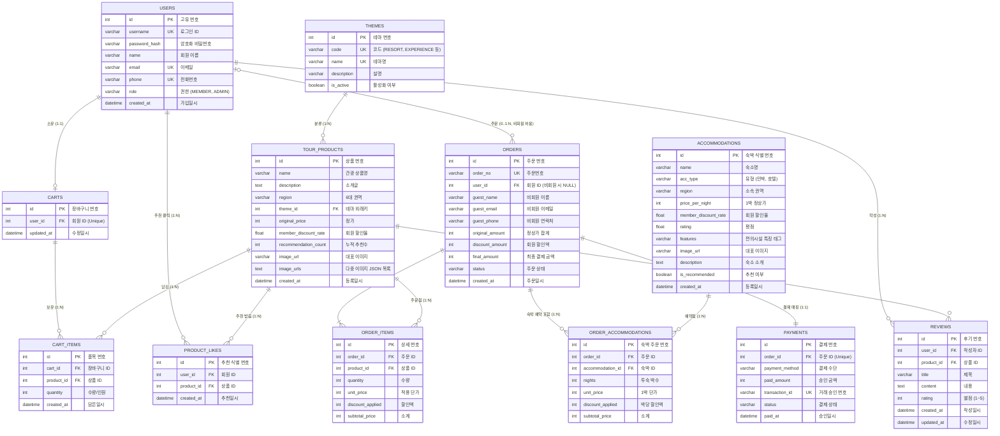

# 🗺️ 대한민국 관광지 안내 & 여행 투어 웹 사이트

Python **Flask** 프레임워크를 기반으로 제작된 대한민국 6대 권역 관광지 안내 및 여행 상품 예약·결제 웹 플랫폼입니다.  
`views`, `templates`, `models`, `forms`가 역할에 따라 체계적으로 분리된 **모듈형 팩토리 아키텍처(Application Factory Pattern)**로 설계되었습니다.

---

## 📌 목차
1. [주요 기능 소개](#1-주요-기능-소개)
2. [기술 스택](#2-기술-스택)
3. [디렉토리 및 파일 구조](#3-디렉토리-및-파일-구조)
4. [시스템 다이어그램 (UML)](#4-시스템-다이어그램-uml)
   - [유스케이스 다이어그램](#41-유스케이스-다이어그램-use-case-diagram)
   - [클래스 다이어그램](#42-클래스-다이어그램-class-diagram)
   - [ER 다이어그램](#43-er-다이어그램-entity-relationship-diagram)
5. [설치 및 실행 방법](#5-설치-및-실행-방법)
6. [테스트 계정 정보](#6-테스트-계정-정보)
7. [자동화 단위 테스트 (Unit Tests)](#7-자동화-단위-테스트-unit-tests)

---

## 1. 주요 기능 소개

### 1) 회원 관리 (Sign Up & Authentication)
- **회원가입**: `ID`, `이름`, `이메일`, `전화번호`, `비밀번호` 필수 입력 및 유효성/중복 검사
- **비밀번호 암호화**: Werkzeug 보안 모듈을 이용한 단방향 해시 암호화 저장
- **로그인/로그아웃**: `Flask-Login` 세션 기반 인증 및 회원 전용 장바구니 자동 연동

### 2) 6대 권역별 인터랙티브 지도 & 관광 상품 안내
- **6대 권역 분리**: 서울/경기, 강원, 충청, 전라, 경북, 제주
- **인터랙티브 지도**: 권역 클릭 시 해당 지역 지도 레이어가 실시간 하이라이트 표시
- **풍부한 추천 데이터**: 6개 권역별 각 6개씩 **총 36개 코스**의 고품질 관광 상품 등록

### 3) 테마별 추천 (확장형 구조)
- `휴양지`, `체험`, `문화/역사` 등 마스터 엔티티 분리로 새로운 테마 카테고리를 유연하게 확장 가능
- 권역 필터와 테마 필터를 동시에 적용하여 맞춤형 여행 코스 탐색 지원

### 4) 실시간 추천 TOP 랭킹 (`/products/popular`)
- 누적 추천 수(`recommendation_count`) 내림차순 정렬
- 🥇 1위, 🥈 2위, 🥉 3위 메달 뱃지 시각화
- 회원 1인 1회 추천(좋아요) 토글 기능 (중복 방지)

### 5) 장바구니 및 회원 우대 할인 결제 시스템
- **장바구니 (`/cart`)**: 담기, 수량 조절, 단일/전체 삭제 및 일괄 주문 연동
- **회원 전용 할인**: 회원은 전 품목 **10% ~ 20% 특별 할인가** 자동 정산
- **비회원 바로 구매 지원**: 비회원도 로그인 없이 정가로 즉시 구매 가능한 **[비회원 바로 구매하기]** 기능 제공 (예약자명, 연락처, 이메일 수집)
- **주문 및 결제 영수증**: 모의 결제 트랜잭션(`Payment`) 생성 및 주문 상세(`OrderItem`) 분리 보관

### 6) 권한별 여행 후기 (Review)
- **비회원**: 등록된 별점(1~5점) 및 후기 **읽기(조회)만 가능**
- **회원**: 로그인 시 상품에 대한 솔직 후기 **직접 작성 및 본인 후기 삭제 가능**

### 7) 관광지별 다채로운 사진 슬라이드 (Carousel Slider)
- **다중 고화질 사진 제공**: 모든 관광지(총 36개 코스)에 3~4개 이상의 테마별 고화질 사진을 적재하여 풍부한 시각 정보 제공 (`image_urls` JSON 필드)
- **인터랙티브 슬라이더**: 상품 상세 페이지에서 좌우 화살표 내비게이션, 사진 번호 카운터(`1 / 4`), 하단 썸네일 스트립을 통해 원하는 사진으로 즉시 이동 가능
- **터치 & 제스처 & 자동 롤링**: 모바일 터치 스와이프 제스처, 키보드 좌우 방향키 탐색, 자동 롤링(마우스 호버 시 일시 정지) 지원
- **탐색 목록 뱃지 표출**: 메인 및 여행 상품 탐색 화면 카드에서 등록된 사진 개수(`📷 4장`) 배지 표출

### 8) 회원 전용 숙박([민박] / [호텔]) 연계 예약 시스템
- **카테고리별 추천 숙박 제공**: 관광지 상세 페이지에서 해당 권역의 엄선된 **[민박]** 및 **[호텔]** 추천 리스트 제공 (전국 총 36개 숙소 데이터베이스 구축)
- **카테고리별 최대 2개 선택 제약**: [민박] 최대 2개, [호텔] 최대 2개까지 자유롭게 선택 가능 (3개 이상 선택 시 자바스크립트 즉각 차단 및 사용자 알림)
- **하단 실시간 합산 예약 바**: 투어 인원수 + 선택한 숙박 추가 요금이 실시간으로 합산되어 총 결제 예정액이 동적으로 계산 표출
- **회원 전용 혜택 배너 (비회원 분기)**: 비회원 접속 시 숙박 선택이 잠금 처리되며 회원가입/로그인 유도 배너 제공
- **통합 결제 및 주문 영수증**: 숙박 선택 후 결제 시 관광 상품과 연계 숙박이 단일 트랜잭션으로 처리되어 `OrderAccommodation`에 스냅샷 저장 및 주문 내역서에 투숙 정보 표시

---

## 2. 기술 스택

| 영역 | 기술 / 라이브러리 | 설명 |
| :--- | :--- | :--- |
| **Backend** | Python 3.12 | 개발 언어 |
| | Flask 3.1+ | 경량 웹 프레임워크 (Application Factory & Blueprints) |
| | Flask-SQLAlchemy 3.1+ | ORM 기반 데이터베이스 모델링 및 관계 관리 |
| | Flask-Login 0.6+ | 사용자 세션 관리 및 접근 제어 (`@login_required`) |
| | Flask-WTF / WTForms | 웹 폼 유효성 검증 및 CSRF 보안 방어 |
| **Database** | SQLite 3 | 경량 관계형 데이터베이스 (`travel.db`) |
| **Frontend** | Jinja2 Templates | HTML5 템플릿 엔진 (템플릿 상속 구조) |
| | Vanilla CSS3 | Pretendard CDN 폰트 기반 모던 반응형 스타일링 |
| | SVG / PNG Layering | 지역별 투명 오버레이 지도 인터랙션 |

---

## 3. 디렉토리 및 파일 구조

```text
d:\hongdonjoo\travel\
├── app.py                     # Flask 앱 팩토리(create_app) 및 구동 엔트리포인트
├── config.py                  # 데이터베이스 및 시크릿 키 환경설정
├── extensions.py              # db, login_manager, csrf 확장 객체 초기화
├── seed_data.py               # 6개 권역 총 36개 상품 및 리뷰 초기 데이터 적재
├── requirements.txt           # 프로젝트 의존성 라이브러리 목록
├── README.md                  # 프로젝트 설명서 (본 파일)
├── travel.db                  # SQLite 데이터베이스
│
├── models/                    # [데이터 모델 분리]
│   ├── __init__.py            # 모델 패키지 모듈 export
│   ├── user.py                # User 모델 (id, username, password_hash, name, email, phone)
│   ├── tour.py                # RegionEnum(6대 권역), Theme(테마), TourProduct, ProductLike, Accommodation(민박/호텔)
│   ├── cart.py                # Cart, CartItem 모델 (소계 및 회원 할인 계산 메서드)
│   ├── order.py               # Order(회원/비회원 통합), OrderItem, OrderAccommodation, Payment 모델
│   └── review.py              # Review 모델 (별점 1~5점, 제목, 내용)
│
├── forms/                     # [입력 폼 검증 분리]
│   ├── __init__.py            # 폼 패키지 모듈 export
│   ├── auth_forms.py          # 회원가입(SignupForm), 로그인(LoginForm)
│   ├── review_forms.py        # 후기 작성(ReviewForm)
│   └── cart_forms.py          # 장바구니 담기 및 수량 변경(AddToCartForm, UpdateCartForm)
│
├── views/                     # [기능별 Blueprint 라우트 분리]
│   ├── __init__.py            # register_blueprints() 블루프린트 일괄 등록
│   ├── main_views.py          # 메인 지도 인터랙션 및 권역별 추천 뷰 (`/`)
│   ├── auth_views.py          # 회원가입, 로그인, 로그아웃 (`/auth`)
│   ├── product_views.py       # 상품 목록, 상세, 인기 랭킹, 추천 토글 (`/products`)
│   ├── cart_views.py          # 장바구니 조회, 담기, 수량 변경, 삭제 (`/cart`)
│   ├── order_views.py         # 회원/비회원 결제, 주문 완료, 주문 내역 (`/order`)
│   └── review_views.py        # 회원 전용 후기 작성 및 삭제 (`/reviews`)
│
├── templates/                 # [기능별 HTML 템플릿 분리]
│   ├── base.html              # 공통 레이아웃 (내비게이션, 장바구니 뱃지, 푸터)
│   ├── index.html             # 메인 화면 (6대 지역 지도 레이어 & 추천 코스)
│   ├── auth/
│   │   ├── signup.html        # 회원가입 폼 화면
│   │   └── login.html         # 로그인 폼 화면
│   ├── product/
│   │   ├── list.html          # 권역/테마/정렬 필터링 여행 상품 목록
│   │   ├── detail.html        # 상품 상세 (회원가/비회원 바로구매, 숙박 연계 예약, 후기 목록)
│   │   └── popular.html       # 🏆 실시간 추천 TOP 랭킹 순위 화면
│   ├── cart/
│   │   └── index.html         # 🛒 내 장바구니 (회원 우대 할인 실시간 반영)
│   ├── order/
│   │   ├── checkout.html      # 주문/결제 화면 (회원/비회원 입력 분기, 연계 숙박 확인)
│   │   ├── complete.html      # 결제 완료 영수증 화면 (투어 및 예약 숙박 영수증)
│   │   └── history.html       # 내 주문 내역 화면
│   └── review/
│       └── create.html        # ✏️ 회원 전용 여행 후기 작성 화면
│
├── static/                    # 정적 에셋
│   ├── css/
│   │   └── style.css          # 통합 모던 반응형 스타일시트
│   └── img/                   # 지도 레이어 PNG 이미지 및 기본 썸네일
│
└── tests/
    └── test_app.py            # 8대 핵심 기능 자동화 단위 테스트 스위트 (총 9개 테스트 통과)
```

---

## 4. 시스템 다이어그램 (UML)

### 4.1. 유스케이스 다이어그램 (Use Case Diagram)



---

### 4.2. 클래스 다이어그램 (Class Diagram)



---

### 4.3. ER 다이어그램 (Entity-Relationship Diagram)



---

## 5. 설치 및 실행 방법

### 1) 사전 준비
- Python 3.10 이상 설치 권장

### 2) 의존성 패키지 설치
```powershell
pip install -r requirements.txt
```

### 3) 초기 데이터 시딩 (6개 권역 36개 관광 상품 & 36개 추천 숙박시설)
```powershell
python seed_data.py
```
> 실행 시 테마 3종, 테스트 계정 5개, 6개 지역 관광 상품 36개(각 3~4장 이상 사진), 권역별 추천 숙박 시설 36개([민박] 18개, [호텔] 18개) 및 실제 여행 후기들이 데이터베이스(`travel.db`)에 자동 등록됩니다.

### 4) 웹 애플리케이션 실행
```powershell
python app.py
```

### 5) 웹 브라우저 접속
- 주소: **`http://localhost:5000`**

---

## 6. 테스트 계정 정보

사이트에 바로 로그인하여 회원 할인 및 후기 작성을 테스트할 수 있는 기본 계정입니다:

| 구분 | 아이디 | 비밀번호 | 이름 | 혜택 및 권한 |
| :--- | :--- | :--- | :--- | :--- |
| **기본 회원** | `hong` | `12341234` | 홍길동 | 전 권역 여행 상품 **10~20% 특별 할인**, **추천 숙박([민박][호텔] 각 최대 2개) 연계 예약**, 장바구니 담기, 상품 추천(❤️), 후기 작성 |
| **추가 회원** | `traveler_kim` | `12341234` | 김여행 | 일반 회원 권한 |

> **비회원 테스트**: 로그인하지 않은 상태에서도 모든 관광 코스 둘러보기, 랭킹 보기, 후기 읽기, **[비회원 바로 구매하기 (정가)]**가 가능하며, 숙박 예약 시에는 회원가입/로그인 유도 안내가 제공됩니다.

---

## 7. 자동화 단위 테스트 (Unit Tests)

프로젝트의 핵심 비즈니스 로직(회원가입, 로그인, 지역/테마 필터, 추천수 랭킹, 장바구니 할인, 회원/비회원 결제, 후기 권한 제어, 다중 사진 슬라이더, 숙박 연계 예약)을 검증하는 9종의 단위 테스트가 완벽히 통과합니다.

### 테스트 실행 명령:
```powershell
python -m unittest tests/test_app.py
```

### 검증 결과:
```text
.........
----------------------------------------------------------------------
Ran 9 tests in 2.950s

OK
```
1. `test_signup_and_login`: 회원가입 필수 필드 검증, 비밀번호 해시, 로그인 세션, 장바구니 자동 생성
2. `test_regional_and_theme_filters`: 6개 권역(제주, 강원 등) 및 테마(체험, 휴양지) 필터 쿼리 검증
3. `test_popular_ranking_screen`: 누적 추천수 내림차순 정렬 및 TOP 랭킹 표출
4. `test_cart_and_member_discount`: 장바구니 품목 수량별 회원 할인액 차감 및 실시간 결제액 정산
5. `test_checkout_and_payment`: 회원 할인 적용 주문 생성, 영수증 보존, 모의 결제 완료 트랜잭션
6. `test_guest_direct_checkout_and_payment`: 비회원 바로 구매 버튼, 정가 결제 진행, 비회원 예약자 정보 저장 및 주문 완료
7. `test_review_permission`: 비회원의 후기 작성 차단(로그인 유도) 및 회원의 별점/후기 등록 권한
8. `test_multi_image_slider_and_retrieval`: 다중 이미지 저장/조회, 캐러셀 렌더링 및 메인 사진 개수 배지 검증
9. `test_member_accommodation_booking_and_checkout`: **회원 전용 숙박([민박][호텔] 각 최대 2개) 연계 예약, 실시간 합산 금액, 체크아웃 및 OrderAccommodation DB 스냅샷 검증**

