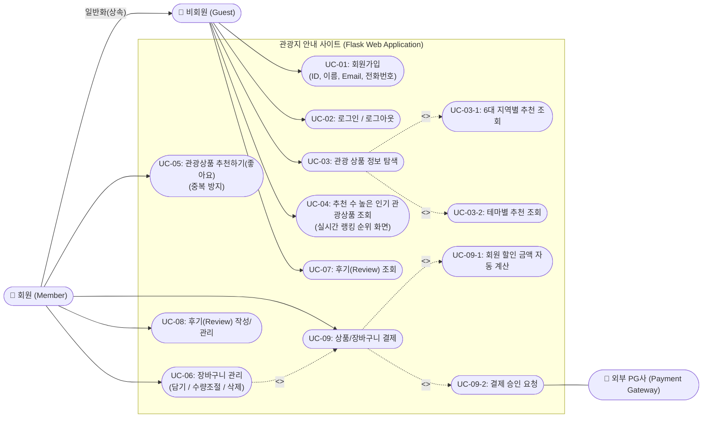
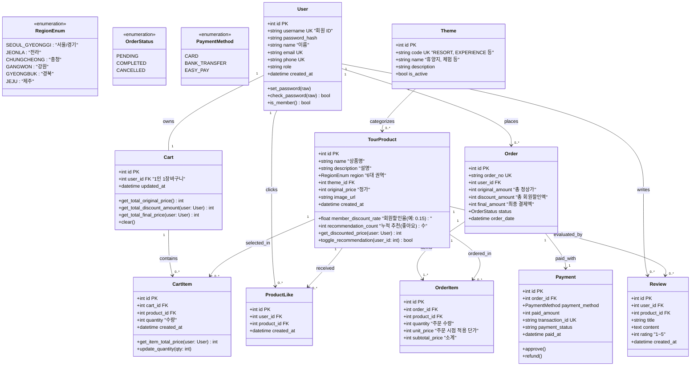

# 관광지 안내 사이트 - 유스케이스(Use Case), 클래스 다이어그램(Class Diagram) 및 화면 설계

Flask 기반 관광지 안내 웹 사이트 개발을 위한 **요구사항 분석, 액터 정의, 유스케이스 다이어그램 & 명세서, 클래스 다이어그램, 화면(UI) 와이어프레임 설계** 문서입니다.

---

## 1. 요구사항 분석 및 액터(Actor) 정의

### 1.1 추가/확장된 요구사항

1. **장바구니 (Cart)**:
   - 추천 및 탐색한 관광/여행 상품을 장바구니에 담기
   - 수량 변경, 개별/전체 삭제, 선택 품목 일괄 주문 및 결제
   - 회원 로그인 시 장바구니 내 품목에 **회원 할인가가 실시간 자동 반영**
2. **추천 수가 높은 관광 상품 화면 (Top Recommended Tour Products)**:
   - 회원은 상품에 '추천(좋아요/Upvote)'을 등록/취소 가능 (중복 추천 방지)
   - 누적 추천 수(`recommendation_count`) 기준으로 내림차순 정렬된 랭킹 화면 제공
   - 6대 지역(서울/경기, 전라, 충청, 강원, 경북, 제주) 및 테마(휴양지, 체험 등)와의 결합 필터 지원

### 1.2 액터(Actor) 정의

- **비회원 (Guest / Anonymous User)**: 로그인하지 않은 일반 방문자
  - 회원가입 및 로그인
  - 관광 상품 탐색 (지역별, 테마별)
  - **추천 수 랭킹 높은 인기 상품 목록 및 상세 조회 가능**
  - 후기(Review) 읽기(조회)만 가능
- **회원 (Member / Authenticated User)**: 가입 및 로그인을 완료한 사용자
  - 비회원의 모든 조회 권한 포함 및 로그아웃
  - **관광 상품에 '추천(좋아요)' 등록 및 취소**
  - **장바구니 담기, 조회, 수량 수정, 삭제 및 일괄 결제**
  - 여행 상품 결제 시 **회원 전용 할인 금액 혜택** 적용
  - 여행 후기(Review) 작성, 수정, 삭제 및 조회
- **외부 결제 시스템 (Payment Gateway / PG사)**:
  - 장바구니 또는 단일 상품 결제 승인 및 검증 처리

---

## 2. 유스케이스 다이어그램 (Use Case Diagram)



---

## 3. 유스케이스 상세 명세서

| 유스케이스 ID          | 유스케이스명              | 액터   | 사전 조건          | 주요 흐름 (Main Flow)                                                                                                                                 | 예외/대체 흐름                        |
| :--------------------- | :------------------------ | :----- | :----------------- | :---------------------------------------------------------------------------------------------------------------------------------------------------- | :------------------------------------ |
| **UC-01**        | 회원가입                  | 비회원 | 비로그인           | 1. 가입 폼 진입2. ID, 이름, Email, 전화번호, 비밀번호 입력3. 유효성 검사 통과 후 계정 등록                                                            | ID/Email 중복 시 에러 메시지 반환     |
| **UC-02**        | 로그인/로그아웃           | 전체   | 회원 계정          | 1. ID/비밀번호 입력 및 인증2. 로그인 성공 시 세션 생성, 로그아웃 시 파기                                                                              | 비밀번호 불일치 시 안내 메시지        |
| **UC-03**        | 관광 상품 탐색            | 전체   | 없음               | 1. 지역별 탭(6개 권역) 또는 테마(휴양지/체험 등) 선택2. 필터링된 상품 목록 확인                                                                       | 검색 결과 부재 시 안내문 표시         |
| **UC-04 (신규)** | 추천수 높은 관광상품 조회 | 전체   | 없음               | 1.**'인기/추천 랭킹' 메뉴 접속**2. 누적 추천 수(`recommendation_count DESC`) 기준 순위 리스트 출력3. 지역/테마 필터와 결합하여 랭킹 확인 가능 | -                                     |
| **UC-05 (신규)** | 관광상품 추천하기         | 회원   | 로그인 상태        | 1. 상품 카드/상세의 '❤️ 추천' 버튼 클릭2. 추천 수 1 증가 및 중복 여부 체크3. 이미 추천한 경우 토글 취소(-1) 처리                                    | 비회원 시도 시 로그인 모달 유도       |
| **UC-06 (신규)** | 장바구니 관리             | 회원   | 로그인 상태        | 1. 상품 상세에서 '장바구니 담기' 클릭2. 장바구니 화면(`/cart`)에서 수량 변경/삭제3. **회원 할인 적용 금액 및 총 결제액 실시간 계산**          | 재고 부족 또는 비회원 시 로그인 유도  |
| **UC-07**        | 후기 조회                 | 전체   | 없음               | 1. 상품 상세 또는 후기 탭에서 이용 후기 및 평점 열람                                                                                                  | -                                     |
| **UC-08**        | 후기 작성                 | 회원   | 로그인 상태        | 1. 평점, 제목, 내용 입력 후 저장2. 목록에 반영                                                                                                        | 비회원은 작성 불가 (로그인 안내)      |
| **UC-09**        | 상품/장바구니 결제        | 회원   | 상품/장바구니 선택 | 1. 바로결제 또는 장바구니 선택상품 결제 진행2. **회원 전용 할인액 차감 후 최종 결제액 표시**3. 결제 승인 후 주문 완료                           | 한도초과/결제취소 시 주문 미완료 처리 |

---

## 4. 클래스 다이어그램 (Class Diagram)

장바구니(`Cart`, `CartItem`), 추천 이력(`ProductLike`), 복수 주문 품목(`OrderItem`)이 확장된 클래스 모델입니다.



---

## 5. 화면(UI) 와이어프레임 설계

### 화면 1: 추천 수가 높은 관광 상품 랭킹 화면 (`/products/popular`)

추천 수(`recommendation_count`)가 높은 인기 상품을 1위부터 순위 배지와 함께 시각화하며, 지역/테마 필터링 및 장바구니 담기가 가능합니다.

```
+-----------------------------------------------------------------------------------+
|  [로고] 대한민국 관광 투어         [지역별 추천] [테마별] [★인기 랭킹] [후기]   [홍길동님] [🛒 장바구니(3)] [로그아웃] |
+-----------------------------------------------------------------------------------+
|                                                                                   |
|  🏆 실시간 추천 관광상품 TOP 랭킹                                                  |
|  여행자들이 가장 많이 추천(❤️)한 베스트 여행 코스입니다.                                 |
|                                                                                   |
|  [지역 필터] [전체] [서울/경기] [강원] [충청] [전라] [경북] [제주]                    |
|  [테마 필터] [전체] [휴양지] [체험]                                                 |
|  [정렬] [● 추천 많은 순] [○ 평점 높은 순] [○ 할인율 높은 순]                           |
|-----------------------------------------------------------------------------------|
|                                                                                   |
|  +-----------------------------------+   +-----------------------------------+   |
|  | [🥇 TOP 1] [제주] [휴양지]         |   | [🥈 TOP 2] [강원] [체험]          |   |
|  |                                   |   |                                   |   |
|  |       [제주 힐링 숲길 & 해변 투어]   |   |       [강원 평창 루지 & 양떼목장]   |   |
|  |                                   |   |                                   |   |
|  |  ❤️ 추천 1,420명   ⭐ 4.9 (후기 340) |   |  ❤️ 추천 1,180명   ⭐ 4.8 (후기 210) |   |
|  |  정가: 120,000원                  |   |  정가: 85,000원                   |   |
|  |  회원 할인가: 96,000원 (20% OFF)  |   |  회원 할인가: 72,250원 (15% OFF)  |   |
|  |                                   |   |                                   |   |
|  |  [❤️ 추천됨]  [🛒 장바구니] [예약] |   |  [🤍 추천하기] [🛒 장바구니] [예약] |   |
|  +-----------------------------------+   +-----------------------------------+   |
|                                                                                   |
|  +-----------------------------------+   +-----------------------------------+   |
|  | [🥉 TOP 3] [전라] [체험]          |   | [4위] [서울/경기] [휴양지]         |   |
|  |       [전주 한옥마을 다도 & 한복체험] |   |       [가평 쁘띠프랑스 & 남이섬]   |   |
|  |  ❤️ 추천 980명    ⭐ 4.8 (후기 188) |   |  ❤️ 추천 890명    ⭐ 4.7 (후기 145) |   |
|  |  정가: 50,000원                   |   |  정가: 65,000원                   |   |
|  |  회원 할인가: 42,500원 (15% OFF)  |   |  회원 할인가: 55,250원 (15% OFF)  |   |
|  |  [🤍 추천하기] [🛒 장바구니] [예약] |   |  [🤍 추천하기] [🛒 장바구니] [예약] |   |
|  +-----------------------------------+   +-----------------------------------+   |
+-----------------------------------------------------------------------------------+
```

---

### 화면 2: 장바구니 화면 (`/cart`)

회원이 담은 여행 상품 리스트, 수량 증감, 회원 할인액 차감 명세, 선택 상품 일괄 주문 기능을 제공합니다.

```
+-----------------------------------------------------------------------------------+
|  [로고] 대한민국 관광 투어         [지역별 추천] [테마별] [인기 랭킹] [후기]   [홍길동님] [🛒 장바구니(2)] [로그아웃] |
+-----------------------------------------------------------------------------------+
|                                                                                   |
|  🛒 내 장바구니 (총 2건)                                                          |
|                                                                                   |
|  +-------------------------------------------------------------+ +---------------+|
|  | [☑ 전체선택 (2/2)]                           [선택삭제]     | | [ 결제 요약 ]  ||
|  +-------------------------------------------------------------+ |               ||
|  | ☑ [썸네일] 제주 힐링 숲길 & 해변 투어                       | | 정상 상품 금액||
|  |    지역: 제주 | 테마: 휴양지                                 | |   205,000원   ||
|  |    정가: 120,000원                                          | |               ||
|  |    회원 혜택가: 96,000원 (20% 할인)                         | | 회원 특별 할인||
|  |    인원/수량: [-] [ 1 ] [+]                                 | | - 36,750원    ||
|  |    소계: 96,000원                              [삭제 ✕]     | | (🎉 회원 혜택)||
|  +-------------------------------------------------------------+ |               ||
|  | ☑ [썸네일] 강원 평창 루지 & 양떼목장 투어                   | | 최종 결제 금액||
|  |    지역: 강원 | 테마: 체험                                   | |  168,250원    ||
|  |    정가: 85,000원                                           | |               ||
|  |    회원 혜택가: 72,250원 (15% 할인)                         | | [주문 결제하기||
|  |    인원/수량: [-] [ 1 ] [+]                                 | |   (총 2건)]   ||
|  |    소계: 72,250원                              [삭제 ✕]     | |               ||
|  +-------------------------------------------------------------+ +---------------+|
|                                                                                   |
|  📢 [안내] 회원 로그인 상태이므로 전 품목 회원 우대 할인가가 자동 계산되었습니다.   |
+-----------------------------------------------------------------------------------+
```

---

## 6. 핵심 설계 및 비즈니스 로직 요약

1. **추천 수 랭킹 정렬 쿼리 (`Flask / SQLAlchemy`)**:
   ```python
   # 추천수가 많은 순으로 정렬 (동점 시 평점순)
   top_products = TourProduct.query.order_by(
       TourProduct.recommendation_count.desc()
   ).limit(10).all()
   ```
2. **중복 추천 방지 로직 (`ProductLike`)**:
   - `(user_id, product_id)` 복합 Unique 제약조건을 설정하여 1인당 1회만 추천 가능.
   - 이미 추천한 경우 다시 누르면 취소(Toggle) 및 카운트 차감(`-1`).
3. **장바구니 회원 할인 자동 정산**:
   - 비회원이 열람할 때는 정가 기준 합계가 안내되지만, **로그인 회원은 품목별 회원 할인율(10~20%)이 자동 차감되어 총 할인 금액과 최종 결제액**이 계산됩니다.
