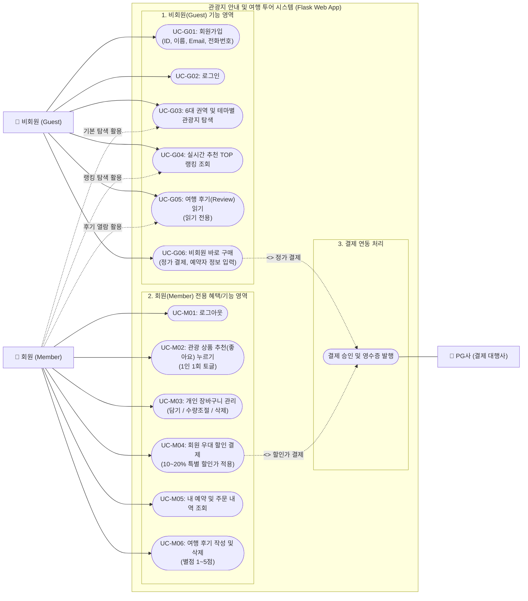

# 관광지 안내 사이트 - 유스케이스(Use Case), 클래스 다이어그램(Class Diagram) 및 화면 설계

Flask 기반 관광지 안내 웹 사이트 개발을 위한 **요구사항 분석, 액터 정의, 유스케이스 다이어그램 & 명세서, 클래스 다이어그램, 화면(UI) 와이어프레임 설계** 문서입니다.

---

## 1. 요구사항 분석 및 액터(Actor) 정의

### 1.1 추가/확장된 요구사항

1. **장바구니 (Cart)**:
   - 추천 및 탐색한 관광/여행 상품을 장바구니에 담기
   - 수량 변경, 개별/전체 삭제, 선택 품목 일괄 주문 및 결제
   - 회원 로그인 시 장바구니 내 품목에 **회원 할인가가 실시간 자동 반영**
2. **추천 수가 높은 관광 상품 화면 (Top Recommended Tour Products)**:
   - 회원은 상품에 '추천(좋아요/Upvote)'을 등록/취소 가능 (중복 추천 방지)
   - 누적 추천 수(`recommendation_count`) 기준으로 내림차순 정렬된 랭킹 화면 제공
   - 6대 지역(서울/경기, 전라, 충청, 강원, 경북, 제주) 및 테마(휴양지, 체험 등)와의 결합 필터 지원

### 1.2 액터(Actor) 정의

- **비회원 (Guest / Anonymous User)**: 로그인하지 않은 일반 방문자
  - 회원가입 및 로그인
  - 관광 상품 탐색 (지역별, 테마별)
  - **추천 수 랭킹 높은 인기 상품 목록 및 상세 조회 가능**
  - 후기(Review) 읽기(조회)만 가능
- **회원 (Member / Authenticated User)**: 가입 및 로그인을 완료한 사용자
  - 비회원의 모든 조회 권한 포함 및 로그아웃
  - **관광 상품에 '추천(좋아요)' 등록 및 취소**
  - **장바구니 담기, 조회, 수량 수정, 삭제 및 일괄 결제**
  - 여행 상품 결제 시 **회원 전용 할인 금액 혜택** 적용
  - 여행 후기(Review) 작성, 수정, 삭제 및 조회
- **외부 결제 시스템 (Payment Gateway / PG사)**:
  - 장바구니 또는 단일 상품 결제 승인 및 검증 처리

---

### 2. 회원/비회원 분리형 유스케이스 다이어그램 (Use Case Diagram)

회원(Member)과 비회원(Guest)의 이용 가능 기능과 권한 범위를 명확하게 영역별로 분리하여 구성한 다이어그램입니다.



---

## 3. 회원 / 비회원 기능 명세서 비교

| 구분 | 유스케이스 ID | 유스케이스명 | 액터 | 사전 조건 | 주요 내용 및 권한 |
| :--- | :--- | :--- | :--- | :--- | :--- |
| **비회원<br>(Guest)** | **UC-G01** | 회원가입 | 비회원 | 비로그인 | ID, 이름, Email, 전화번호, 비밀번호 검증 후 계정 등록 |
| | **UC-G02** | 로그인 | 비회원 | 계정 보유 | ID/비밀번호 인증 후 회원 세션 생성 |
| | **UC-G03** | 권역/테마별 관광지 조회 | 전체 | 없음 | 6개 권역 지도 레이어 및 테마별 상품 탐색 (정가 표시) |
| | **UC-G04** | 실시간 추천 TOP 랭킹 조회 | 전체 | 없음 | 추천 수(`recommendation_count`) 기준 실시간 랭킹 순위 조회 |
| | **UC-G05** | 여행 후기 열람 | 전체 | 없음 | 상품별 등록된 별점 및 솔직 후기 **읽기만 가능** |
| | **UC-G06** | **비회원 바로 구매** | **비회원** | 상품 선택 | **로그인 없이 정가로 즉시 결제** (예약자 성함, 휴대폰, 이메일 수집) |
| **회원<br>(Member)** | **UC-M01** | 로그아웃 | 회원 | 로그인 | 세션 파기 후 메인 화면 이동 |
| | **UC-M02** | **상품 추천(좋아요)** | **회원** | 로그인 | 마음에 드는 상품에 1인 1회 추천 등록 및 취소(토글) |
| | **UC-M03** | **장바구니 관리** | **회원** | 로그인 | 전용 장바구니에 상품 담기, 수량 변경, 삭제, 비우기 |
| | **UC-M04** | **회원 할인 결제** | **회원** | 로그인 | **전 품목 10~20% 특별 할인가 적용** 단일 또는 장바구니 일괄 결제 |
| | **UC-M05** | 내 주문 내역 확인 | 회원 | 로그인 | 본인의 과거 예약/결제 내역 및 영수증 조회 |
| | **UC-M06** | **후기 작성 및 삭제** | **회원** | 로그인 | **별점(1~5점) 및 후기 신규 등록**, 본인이 작성한 후기 삭제 권한 |

---

## 4. 클래스 다이어그램 (Class Diagram)

장바구니(`Cart`, `CartItem`), 추천 이력(`ProductLike`), 복수 주문 품목(`OrderItem`)이 확장된 클래스 모델입니다.


---

## 5. 화면(UI) 와이어프레임 설계

### 화면 1: 추천 수가 높은 관광 상품 랭킹 화면 (`/products/popular`)

추천 수(`recommendation_count`)가 높은 인기 상품을 1위부터 순위 배지와 함께 시각화하며, 지역/테마 필터링 및 장바구니 담기가 가능합니다.

```
+-----------------------------------------------------------------------------------+
|  [로고] 대한민국 관광 투어         [지역별 추천] [테마별] [★인기 랭킹] [후기]   [홍길동님] [🛒 장바구니(3)] [로그아웃] |
+-----------------------------------------------------------------------------------+
|                                                                                   |
|  🏆 실시간 추천 관광상품 TOP 랭킹                                                  |
|  여행자들이 가장 많이 추천(❤️)한 베스트 여행 코스입니다.                                 |
|                                                                                   |
|  [지역 필터] [전체] [서울/경기] [강원] [충청] [전라] [경북] [제주]                    |
|  [테마 필터] [전체] [휴양지] [체험]                                                 |
|  [정렬] [● 추천 많은 순] [○ 평점 높은 순] [○ 할인율 높은 순]                           |
|-----------------------------------------------------------------------------------|
|                                                                                   |
|  +-----------------------------------+   +-----------------------------------+   |
|  | [🥇 TOP 1] [제주] [휴양지]         |   | [🥈 TOP 2] [강원] [체험]          |   |
|  |                                   |   |                                   |   |
|  |       [제주 힐링 숲길 & 해변 투어]   |   |       [강원 평창 루지 & 양떼목장]   |   |
|  |                                   |   |                                   |   |
|  |  ❤️ 추천 1,420명   ⭐ 4.9 (후기 340) |   |  ❤️ 추천 1,180명   ⭐ 4.8 (후기 210) |   |
|  |  정가: 120,000원                  |   |  정가: 85,000원                   |   |
|  |  회원 할인가: 96,000원 (20% OFF)  |   |  회원 할인가: 72,250원 (15% OFF)  |   |
|  |                                   |   |                                   |   |
|  |  [❤️ 추천됨]  [🛒 장바구니] [예약] |   |  [🤍 추천하기] [🛒 장바구니] [예약] |   |
|  +-----------------------------------+   +-----------------------------------+   |
|                                                                                   |
|  +-----------------------------------+   +-----------------------------------+   |
|  | [🥉 TOP 3] [전라] [체험]          |   | [4위] [서울/경기] [휴양지]         |   |
|  |       [전주 한옥마을 다도 & 한복체험] |   |       [가평 쁘띠프랑스 & 남이섬]   |   |
|  |  ❤️ 추천 980명    ⭐ 4.8 (후기 188) |   |  ❤️ 추천 890명    ⭐ 4.7 (후기 145) |   |
|  |  정가: 50,000원                   |   |  정가: 65,000원                   |   |
|  |  회원 할인가: 42,500원 (15% OFF)  |   |  회원 할인가: 55,250원 (15% OFF)  |   |
|  |  [🤍 추천하기] [🛒 장바구니] [예약] |   |  [🤍 추천하기] [🛒 장바구니] [예약] |   |
|  +-----------------------------------+   +-----------------------------------+   |
+-----------------------------------------------------------------------------------+
```

---

### 화면 2: 장바구니 화면 (`/cart`)

회원이 담은 여행 상품 리스트, 수량 증감, 회원 할인액 차감 명세, 선택 상품 일괄 주문 기능을 제공합니다.

```
+-----------------------------------------------------------------------------------+
|  [로고] 대한민국 관광 투어         [지역별 추천] [테마별] [인기 랭킹] [후기]   [홍길동님] [🛒 장바구니(2)] [로그아웃] |
+-----------------------------------------------------------------------------------+
|                                                                                   |
|  🛒 내 장바구니 (총 2건)                                                          |
|                                                                                   |
|  +-------------------------------------------------------------+ +---------------+|
|  | [☑ 전체선택 (2/2)]                           [선택삭제]     | | [ 결제 요약 ]  ||
|  +-------------------------------------------------------------+ |               ||
|  | ☑ [썸네일] 제주 힐링 숲길 & 해변 투어                       | | 정상 상품 금액||
|  |    지역: 제주 | 테마: 휴양지                                 | |   205,000원   ||
|  |    정가: 120,000원                                          | |               ||
|  |    회원 혜택가: 96,000원 (20% 할인)                         | | 회원 특별 할인||
|  |    인원/수량: [-] [ 1 ] [+]                                 | | - 36,750원    ||
|  |    소계: 96,000원                              [삭제 ✕]     | | (🎉 회원 혜택)||
|  +-------------------------------------------------------------+ |               ||
|  | ☑ [썸네일] 강원 평창 루지 & 양떼목장 투어                   | | 최종 결제 금액||
|  |    지역: 강원 | 테마: 체험                                   | |  168,250원    ||
|  |    정가: 85,000원                                           | |               ||
|  |    회원 혜택가: 72,250원 (15% 할인)                         | | [주문 결제하기||
|  |    인원/수량: [-] [ 1 ] [+]                                 | |   (총 2건)]   ||
|  |    소계: 72,250원                              [삭제 ✕]     | |               ||
|  +-------------------------------------------------------------+ +---------------+|
|                                                                                   |
|  📢 [안내] 회원 로그인 상태이므로 전 품목 회원 우대 할인가가 자동 계산되었습니다.   |
+-----------------------------------------------------------------------------------+
```

---

## 6. 핵심 설계 및 비즈니스 로직 요약

1. **추천 수 랭킹 정렬 쿼리 (`Flask / SQLAlchemy`)**:
   ```python
   # 추천수가 많은 순으로 정렬 (동점 시 평점순)
   top_products = TourProduct.query.order_by(
       TourProduct.recommendation_count.desc()
   ).limit(10).all()
   ```
2. **중복 추천 방지 로직 (`ProductLike`)**:
   - `(user_id, product_id)` 복합 Unique 제약조건을 설정하여 1인당 1회만 추천 가능.
   - 이미 추천한 경우 다시 누르면 취소(Toggle) 및 카운트 차감(`-1`).
3. **장바구니 회원 할인 자동 정산**:
   - 비회원이 열람할 때는 정가 기준 합계가 안내되지만, **로그인 회원은 품목별 회원 할인율(10~20%)이 자동 차감되어 총 할인 금액과 최종 결제액**이 계산됩니다.
