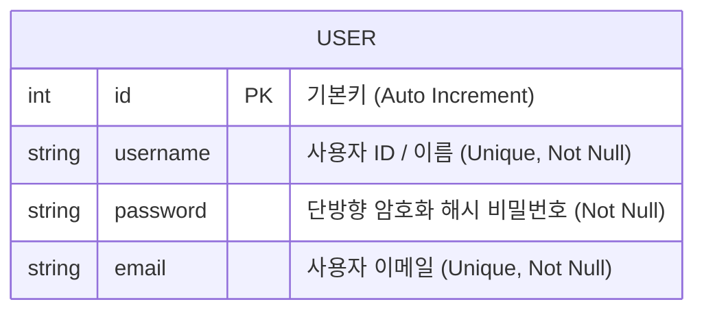

DataBase

```*mermaid
```



```mermaid
erDiagram

    USER {
        int id PK "기본키 (Auto Increment)"
        string username "사용자 ID / 이름 (Unique, Not Null)"
        string password "단방향 암호화 해시 비밀번호 (Not Null)"
        string email "사용자 이메일 (Unique, Not Null)"
    }
```


```
```
