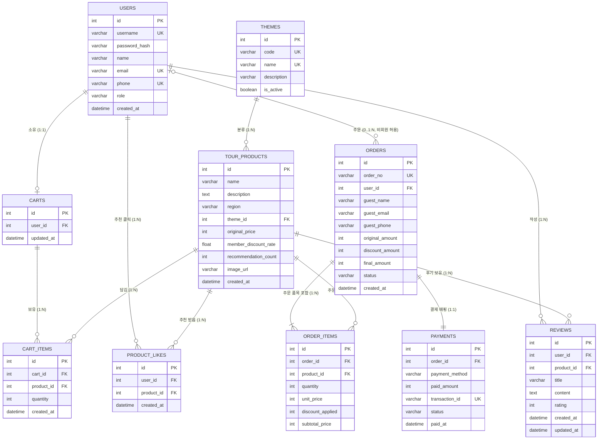

# Database ER Diagram

본 프로젝트의 상세 데이터베이스 모델링 및 ERD 명세는 [DATABASE_UML.md](DATABASE_UML.md)를 참고해 주시기 바랍니다.

```mermaid
erDiagram
    USERS ||--o| CARTS : "소유 (1:1)"
    CARTS ||--o{ CART_ITEMS : "보유 (1:N)"
    TOUR_PRODUCTS ||--o{ CART_ITEMS : "담김 (1:N)"

    THEMES ||--o{ TOUR_PRODUCTS : "분류 (1:N)"

    USERS ||--o{ PRODUCT_LIKES : "추천 클릭 (1:N)"
    TOUR_PRODUCTS ||--o{ PRODUCT_LIKES : "추천 받음 (1:N)"

    USERS |o--o{ ORDERS : "주문 (0..1:N, 비회원 허용)"
    ORDERS ||--|{ ORDER_ITEMS : "주문 품목 포함 (1:N)"
    TOUR_PRODUCTS ||--o{ ORDER_ITEMS : "주문됨 (1:N)"
    ORDERS ||--|| PAYMENTS : "결제 매핑 (1:1)"

    USERS ||--o{ REVIEWS : "작성 (1:N)"
    TOUR_PRODUCTS ||--o{ REVIEWS : "후기 보유 (1:N)"

    USERS {
        int id PK
        varchar username UK
        varchar password_hash
        varchar name
        varchar email UK
        varchar phone UK
        varchar role
        datetime created_at
    }

    THEMES {
        int id PK
        varchar code UK
        varchar name UK
        varchar description
        boolean is_active
    }

    TOUR_PRODUCTS {
        int id PK
        varchar name
        text description
        varchar region
        int theme_id FK
        int original_price
        float member_discount_rate
        int recommendation_count
        varchar image_url
        datetime created_at
    }

    PRODUCT_LIKES {
        int id PK
        int user_id FK
        int product_id FK
        datetime created_at
    }

    CARTS {
        int id PK
        int user_id FK
        datetime updated_at
    }

    CART_ITEMS {
        int id PK
        int cart_id FK
        int product_id FK
        int quantity
        datetime created_at
    }

    ORDERS {
        int id PK
        varchar order_no UK
        int user_id FK
        varchar guest_name
        varchar guest_email
        varchar guest_phone
        int original_amount
        int discount_amount
        int final_amount
        varchar status
        datetime created_at
    }

    ORDER_ITEMS {
        int id PK
        int order_id FK
        int product_id FK
        int quantity
        int unit_price
        int discount_applied
        int subtotal_price
    }

    PAYMENTS {
        int id PK
        int order_id FK
        varchar payment_method
        int paid_amount
        varchar transaction_id UK
        varchar status
        datetime paid_at
    }

    REVIEWS {
        int id PK
        int user_id FK
        int product_id FK
        varchar title
        text content
        int rating
        datetime created_at
        datetime updated_at
    }
```
